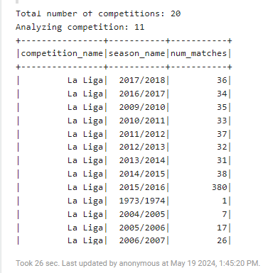

# Phase 4 - Analyse des données, choix finaux et résultats

Dans cette dernière phase, nous allons vous présenter les résultats obtenus après avoir analysé les données, sélectionné les features pertinents et entraîné nos modèles de machine learning avce spark dans les différents Zepellin. Nous allons également discuter des choix finaux que nous avons faits et des améliorations possibles pour notre projet.

## Choix et direction du projet

Après avoir fait une première analyse dans la phase 3 et après avoir parlé avec les responsables du cours, nous sommes arrivés à la conclusion de certains points : 

- Le dataset est séparé en plusieurs saisons et compétitions. Cette structure malheureusement nous donne pas assez de match. Le dataset possède un total de 3316 matchs, tous répartis sur plusieurs saisons et compétitions. Le grand problème est qu'on ne possède pas assez de matchs "récurrents", c'est à dire des matchs entre les mêmes équipes. Cela rend difficile la prédiction des scores des matchs futurs.
- Les features que nous avons sélectionnés dans la phase 3 ne peut pas être récupéré pour toutes les équipes. Cela rends alors presque impossible de créer un modèle d'assez compétent pour prédire les scores des matchs.



Nous avons alors décidé de partir sur deux autres modèles différents.

### Modèle 1 : Prédiction du vainqueur d'un match (away, home)

Dans ce modèle, nous allons essayer de prédire le vainqueur d'un match. Pour cela, nous allons utiliser les features suivants :

```
root
 |-- match_id: string (non utilisé)
 |-- match_teams: string (non utilisé)
 |-- Pass_team1: long (utilisé)
 |-- Pass_team2: long (utilisé)
 |-- Shot_team1: long (utilisé)
 |-- Shot_team2: long (utilisé)
 |-- Foul_won_team1: long (utilisé)
 |-- Foul_won_team2: long (utilisé)
 |-- Foul_committed_team1: long (utilisé)
 |-- Foul_committed_team2: long (utilisé)
 |-- Bad_Behaviour_Yellow_Card_team1: long (utilisé)
 |-- Bad_Behaviour_Yellow_Card_team2: long (utilisé)
 |-- total_red_cards_team1: long (utilisé)
 |-- total_red_cards_team2: long (utilisé)
 |-- total_actions_team1: long (utilisé)
 |-- total_actions_team2: long (utilisé)
 |-- match_date: string (utilisé)
 |-- home_score: long (utilisé)
 |-- away_score: long (utilisé)
 |-- home_team_id: long (utilisé)
 |-- team1_results: double (utilisé)
 |-- away_team_id: long (utilisé)
 |-- team2_results: double (utilisé)
 |-- winning_team: string (non utilisé) --> utilisé pour la ground truth (valeur y)
```
Pour les deux équipes, nous avons défini un total de 21 features. Ces features permettent de décrire le match en question. Les features avec les valeurs `team1` ou `home` se réfèrent à l'équipe à domicile, tandis que celles avec `team2` ou `away` concernent l'équipe en déplacement.

Concernant la valeur y, nous avons décidé après certains tests de supprimer les valeurs draws. En effet, nous avons remarqué que les draws étaient très peu fréquents dans notre dataset. Nous avons donc décidé de les supprimer pour simplifier notre modèle. Nous avons alors un total de : 

- **Nombres de matchs avec une victoire de l'équipe à domicile** : 1502
- **Nombres de matchs avec une victoire de l'équipe à l'extérieur** : 1054

Malgré qu'il y ait plus de victoires à domicile que de victoires à l'extérieur, nous avons décidé de laisser cela comme de cette façon.

### Modèle 2 : Prédiction des types d'actions d'un match (pass, shot, foul, etc.)

Pour le deuxième modèle, nous avons décidé de prédire les types d'actions d'un match. Dans le dossier events, nous avons chaque fichier qui représente un match. Chaque match contient plusieurs actions à la suite. Voici toutes les classes possibles lors de la prédiction des actions :

- **Ball Receipt**
- **Ball Recovery**
- **Dispossessed**
- **Duel**
- **Camera On**
- **Block**
- **Offside**
- **Clearance**
- **Interception**
- **Dribble**
- **Pressure**
- **Half Start**
- **Substitution**
- **Own Goal Against**
- **Foul Won**
- **Foul Committed**
- **Goal Keeper**
- **Bad Behaviour**
- **Own Goal For**
- **Player On**
- **Player Off**
- **Shield**
- **Pass**
- **50/50**
- **Half End**
- **Starting XI**
- **Tactical Shift**

Pour une première version, nous avons décidé de prédire les actions suivantes :

Nous allons récupérer toutes les actions présentes dans l'ensemble du dossier "events". Ensuite, nous créons une sorte de sliding window pour former des séquences d'actions. L'objectif est de prédire la prochaine action en se basant sur les actions précédentes.

Voici un exemple de fonctionnement avec 5 actions consécutives :

```
[Pass, Duel, Foul, Shot, Pass] --> [Pass]
[Duel, Foul, Shot, Pass, Pass] --> [Pass]
[Foul, Shot, Pass, Pass, Pass] --> [Shot]
```

Étant donné que notre dossier "events" contient environ 10 Go de données, cette méthode augmentera considérablement la taille totale de notre dataset. Cela s'inscrit pleinement dans le cadre du cours de Big Data.

## Résultats obtenus et comparaison des modèles

### Modèle 1 : Prédiction du vainqueur d'un match (away, home)


### Modèle 2 : Prédiction des types d'actions d'un match (pass, shot, foul, etc.)

