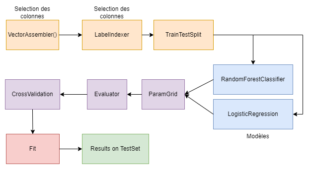

# Phase 4 - Analyse des données, choix finaux et résultats

Dans cette dernière phase, nous allons vous présenter les résultats obtenus après avoir analysé les données, sélectionné les features pertinents et entraîné nos modèles de machine learning avce spark dans les différents Zepellin. Nous allons également discuter des choix finaux que nous avons faits et des améliorations possibles pour notre projet.

## Choix et direction du projet

Après avoir fait une première analyse dans la phase 3 et après avoir parlé avec les responsables du cours, nous sommes arrivés à la conclusion de certains points : 

- Le dataset est séparé en plusieurs saisons et compétitions. Cette structure malheureusement nous donne pas assez de match. Le dataset possède un total de 3316 matchs, tous répartis sur plusieurs saisons et compétitions. Le grand problème est qu'on ne possède pas assez de matchs "récurrents", c'est à dire des matchs entre les mêmes équipes. Cela rend difficile la prédiction des scores des matchs futurs.
- Les features que nous avons sélectionnés dans la phase 3 ne peut pas être récupéré pour toutes les équipes. Cela rends alors presque impossible de créer un modèle d'assez compétent pour prédire les scores des matchs.


Nous avons alors décidé de partir sur deux autres modèles différents qui seront décris dans les chapitres suivants.

## Modèle 1 : Prédiction du vainqueur d'un match (away, home)

Dans ce modèle, nous allons essayer de prédire le vainqueur d'un match. Pour cela, nous allons utiliser les features suivants :

```
root
 |-- match_id: string (non utilisé)
 |-- match_teams: string (non utilisé)
 |-- Pass_team1: long (utilisé)
 |-- Pass_team2: long (utilisé)
 |-- Shot_team1: long (utilisé)
 |-- Shot_team2: long (utilisé)
 |-- Foul_won_team1: long (utilisé)
 |-- Foul_won_team2: long (utilisé)
 |-- Foul_committed_team1: long (utilisé)
 |-- Foul_committed_team2: long (utilisé)
 |-- Bad_Behaviour_Yellow_Card_team1: long (utilisé)
 |-- Bad_Behaviour_Yellow_Card_team2: long (utilisé)
 |-- total_red_cards_team1: long (utilisé)
 |-- total_red_cards_team2: long (utilisé)
 |-- total_actions_team1: long (utilisé)
 |-- total_actions_team2: long (utilisé)
 |-- match_date: string (utilisé)
 |-- home_score: long (utilisé)
 |-- away_score: long (utilisé)
 |-- home_team_id: long (utilisé)
 |-- team1_results: double (utilisé)
 |-- away_team_id: long (utilisé)
 |-- team2_results: double (utilisé)
 |-- winning_team: string (non utilisé) --> utilisé pour la ground truth (valeur y)
```
Pour les deux équipes, nous avons défini un total de 21 features. Ces features permettent de décrire le match en question. Les features avec les valeurs `team1` ou `home` se réfèrent à l'équipe à domicile, tandis que celles avec `team2` ou `away` concernent l'équipe en déplacement.

Concernant la valeur y, nous avons décidé après certains tests de supprimer les valeurs draws. En effet, nous avons remarqué que les draws étaient très peu fréquents dans notre dataset. Nous avons donc décidé de les supprimer pour simplifier notre modèle. Nous avons alors un total de : 

- **Nombres de matchs avec une victoire de l'équipe à domicile** : 1502
- **Nombres de matchs avec une victoire de l'équipe à l'extérieur** : 1054

Malgré qu'il y ait plus de victoires à domicile que de victoires à l'extérieur, nous avons décidé de laisser cela comme de cette façon.

## Modèle 2 : Prédiction des types d'actions d'un match (pass, shot, foul, etc.)

Pour le deuxième modèle, nous avons décidé de prédire les types d'actions d'un match. Dans le dossier events, nous avons chaque fichier qui représente un match. Chaque match contient plusieurs actions à la suite. Voici toutes les classes possibles lors de la prédiction des actions :

- **Ball Receipt** (id: 42)
- **Ball Recovery** (2)
- **Dispossessed** (3)
- **Duel** (4)
- **Camera On** (5)
- **Block** (6)
- **Offside** (8)
- **Clearance** (9)
- **Interception** (10)
- **Dribble** (14)
- **Pressure** (17)
- **Half Start** (18)
- **Substitution** (19)
- **Own Goal Against** (20)
- **Foul Won** (21)
- **Foul Committed** (22)
- **Goal Keeper** (23)
- **Bad Behaviour** (24)
- **Own Goal For** (25)
- **Player On** (26)
- **Player Off** (27)
- **Shield** (28)
- **Pass** (30)
- **50/50** (33)
- **Half End** (34)
- **Starting XI** (35)
- **Tactical Shift** (36)
- **Error** (37)
- **Miscontrol** (38)
- **Dribbled Past** (39)
- **Injury Stoppage** (40)
- **Referee Ball-Drop** (41)
- **Carry** (43)

Les IDs seront utilisés pour la prédiction des actions. Toutes les fichiers events présent dans le dossier "events" seront utilisés pour la prédiction des actions.

Toutes les prédictions seront basées sur une fenêtre glissante représentant une suite d'actions. En prenant les X actions précédentes, nous allons essayer de prédire la prochaine action.

Voici un exemple de fonctionnement avec 5 actions consécutives :

```
[Pass, Duel, Foul, Shot, Pass] --> [Pass]
[Duel, Foul, Shot, Pass, Pass] --> [Pass]
[Foul, Shot, Pass, Pass, Pass] --> [Shot]
```

Étant donné que notre dossier "events" contient environ 10 Go de données, cette méthode augmentera considérablement la taille totale de notre dataset. Cela s'inscrit pleinement dans le cadre du cours de Big Data.

**Version 1**

Dans un premier temps, le but est de réaliser la fênetre glissante la plus simple possible. Nous allons prendre les 5 actions précédentes pour prédire la prochaine action. Nous allons alors avoir un total de 6 features pour chaque ligne de notre dataset. La constiution de notre dataset ne tiendra pas compte de la séparation des matchs, la fenêtre glissante sera réalisée sur l'ensemble des actions.

Pareil pour la prédiction, 20% des données seront utilisées pour le test et 80% pour l'entraînement, en choisissant aléatoirement les données.

**Version 2**

Cette version 2 corrige tous les bugs de la v1 en prenant en compte la séparation des matchs. Nous allons alors prendre les 5 actions précédentes pour prédire la prochaine action, match par match. Ensuite, le dataset va être séparé de façon à laisser les 20% des matchs pour le test et les 80% restants pour l'entraînement. Les données de test seront forcément nouvelles pour le modèle, vu que nous avons pris en compte la séparation des matchs.

## Résultats obtenus et comparaison des modèles

Dans ce chapitre, nous allons détailler les résultats obtenus. Il est important de mentionner que, dans la présentation finale, nous avons inclus des exemples illustrant comment nous avons utilisé Spark et Scala pour effectuer les différents prétraitements ainsi que pour créer les pipelines de Spark MLlib.

### Modèle 1 : Prédiction du Vainqueur d'un Match (away, home)

Après plusieurs itérations visant à optimiser les hyperparamètres par cross validation, nous avons obtenu des résultats satisfaisants. Nous avons pu évaluer les features générées sur deux modèles distincts. En raison de problèmes rencontrés avec certains autres modèles, nous nous sommes concentrés sur ces deux approches.

Voici les résultats obtenus :

- **Logistic Regression** : 70,4%
- **Random Forest** : 68,24%

La logistic regression s'avère être le meilleur modèle pour prédire le vainqueur d'un match, avec une précision de 70,4%. Bien que ce soit un résultat prometteur, une analyse sur un plus grand nombre de matchs est nécessaire pour évaluer pleinement la robustesse du modèle.

Voici la pipeline final du modèle 1 : 



### Modèle 2 : Prédiction des types d'actions d'un match (pass, shot, foul, etc.)
**Version 1**

Dans la version 1, le modèle obtient 73% de précision. Cela signifie que le modèle est capable de prédire correctement 73% des actions. Le résultat est bon mais il est difficile d'estimer les capacités du modèle vu la séparation entre les sets d'entraînement et de test.
Ce modèle sert surtout à tester la mise en place du code dans son ensemble et de son bon fonctionnement.

**Version 2**

Dans la version 2, le modèle obtient 3% de précision. Cela signifie que le modèle est capable de prédire correctement 3% des actions, ce qui est très faible.

Cependant, en observant de plus prêt les résultats, les prédictions du modèle ne sont pas si incohérentes, malgré qu'elles soient fausses, prenons l'extrait du notebook :

- 30 (**Pass**) au lieu de 6 (**Block**): Block signifie que l'équipe adverse a bloqué le ballon, le modèle lui a prédit une passe, pour lui la passe précédente était réussie et l'équipe aurait fait une nouvelle passe.
- 30 (**Pass**) au lieu de 2 (**Ball Recovery**): Ball Recovery signifie que l'équipe a récupéré le ballon parce que la passe précédente était ratée. Le modèle voyait la passe précédente comme réussie et a prédit une nouvelle passe.
- 4 (**Duel**) au lieu de 14 (**Dribble**): Dribble signifie qu'un joueur a tenté de dribbler un adversaire, le modèle a prédit un duel, soit une contestation 50/50 du ballon, ce qui est assez proche.
- 30 (**Pass**) au lieu de 3 (**Dispossessed**): Dispossessed signifie qu'un joueur a perdu le ballon, le modèle a prédit une passe, soit une action qui aurait pu être faite si le joueur avait réussi sa passe.
- 23 (**Goal Keeper**) au lieu de 9 (**Clearance**): Clearance signifie qu'un joueur a dégagé le ballon, le modèle a prédit une action du gardien de but, soit une action qui aurait pu être faite si le défenseur n'avait pas dégagé le ballon.
- ...

On peut voir que par ces exemples, le modèle n'est pas si mauvais que ça, il a juste besoin d'être amélioré car il arrive à prédire des actions proches de la réalité. Il est peut-être également possible que prédire les actions d'un match soit une tâche non triviale.

## Améliorations futurs

- **Augmentation de la Taille du dataset** : Tester le modèle sur un plus grand nombre de matchs permettrait d’évaluer sa robustesse et de garantir que les résultats ne sont pas dus à des variations aléatoires dans un échantillon assez petit comme nous on a.
- **Amélioration des Features** : Il serait intéressant de pouvoir tester d'autres features pour voir si le modèle peut être amélioré. Une analyse robuste sur le poids que chaque feature a dans la prédiction des scores serait également intéressante.
- **Cross-Validation et GridSearch** : Nous utilisons déjà la cross validation, mais il serait intéressant de tester d'autres méthodes et d'autres hyperparamètres pour voir si le modèle peut être amélioré. Combiné cela avec le test d'autres modèles serait également une plus-value pour le projet.

## Conclusion

Dans l'ensemble, nous avons obtenu de bons résultats avec ce projet. C'était très intéressant qui nous a permis d'approfondir nos connaissances en Scala et notamment d'explorer les différentes fonctionnalités de Spark. Le projet nous a également offert l'opportunité de mettre en pratique les concepts de machine learning dans un contexte de big data.

Nous avons pu constater l'importance d'une bonne préparation et sélection des features pour obtenir des modèles performants et surtout de voir à quel point ça prends autant de temps. Malgré les défis rencontrés, notamment liés à la taille et la structure du dataset, nous avons réussi à développer des modèles avec de bons résultats.